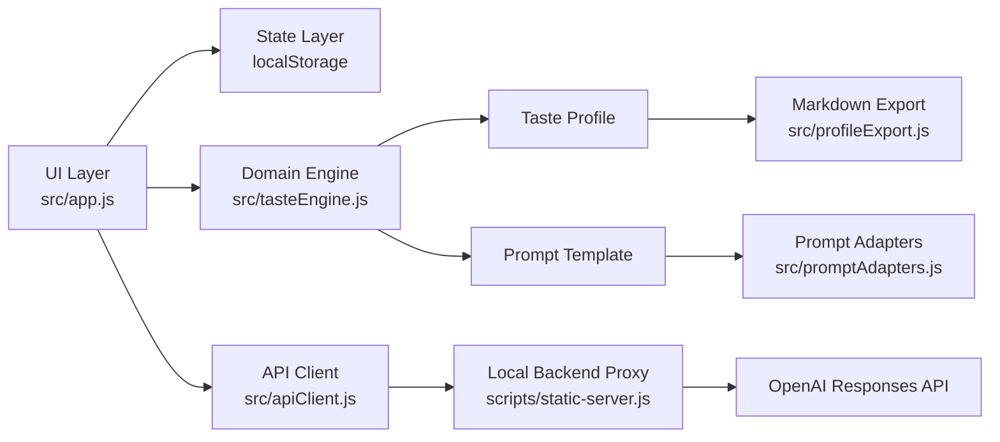
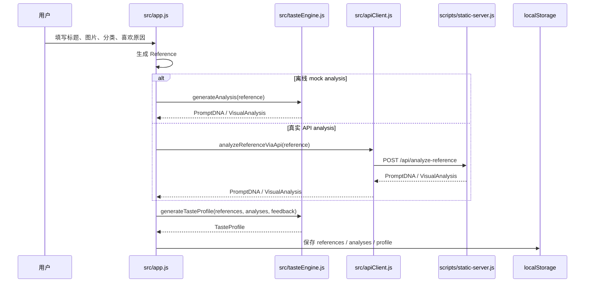
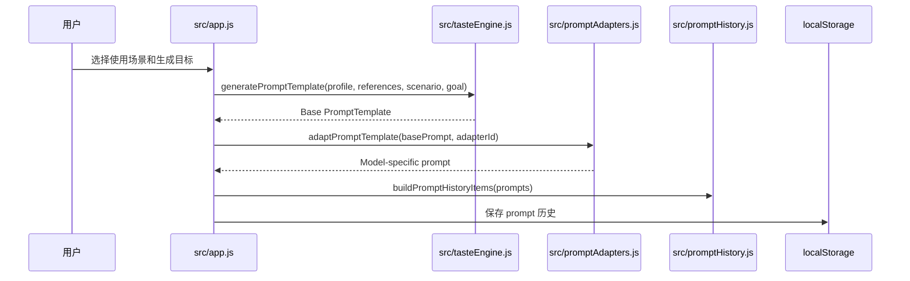
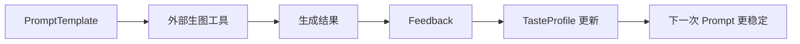
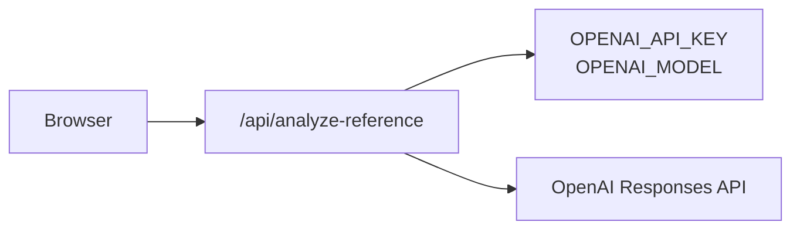

# TasteOS 数据流与模块架构

这份文档用于解释 TasteOS 的技术结构。重点不是罗列文件，而是说明数据如何从“用户参考图”流向“Prompt DNA”“审美画像”和“prompt 模板”。

## 1. 架构总览



核心分层：

- UI Layer：负责页面渲染、表单交互、用户操作。
- State Layer：负责本地状态持久化。
- Domain Engine：负责视觉分析、审美画像聚合、prompt 生成。
- API Client：负责从前端请求真实分析接口。
- Backend Proxy：负责隐藏 API Key，并调用 OpenAI。
- Prompt Adapters：负责把同一份 prompt 转成不同模型/工具的格式。

## 2. 核心数据对象

### Reference

用户保存的一张视觉参考图。

```text
Reference
- id
- title
- imageUrl
- category
- source
- userNote
- createdAt
- analysisId
```

它代表“用户喜欢什么图”和“为什么喜欢”。

### VisualAnalysis

系统对单张参考图反推出来的 Prompt DNA，兼容原来的视觉分析字段。

```text
VisualAnalysis
- id
- referenceId
- inferredPrompt
- keyPromptTerms
- negativePromptTerms
- usageCategory
- styleCategory
- compositionTerms
- colorTerms
- typographyTerms
- moodTerms
- reusablePromptPatterns
- composition
- colorPalette
- colorDescription
- typography
- informationHierarchy
- moodTags
- styleTags
- usageScenario
- reusablePatterns
- avoidPatterns
```

它是整个项目最关键的中间层。mock analysis 和真实 API analysis 都必须输出这个结构。新的产品表达更偏 Prompt DNA，旧的构图、色彩、字体字段作为兼容层继续支撑 Taste Profile。

### TasteProfile

系统从多张参考图中聚合出的个人审美画像。

```text
TasteProfile
- layoutPreferences
- colorPreferences
- typographyPreferences
- moodPreferences
- informationDensity
- negativePreferences
- evidenceReferenceIds
- updatedAt
```

它代表“用户长期偏好”。

### PromptTemplate

基于 Taste Profile 和使用场景生成的 prompt。

```text
PromptTemplate
- scenario
- goal
- prompt
- negativePrompt
- basedOnProfileId
- basedOnReferenceIds
- adapterId
- adapterLabel
- createdAt
```

它代表“可以复制到外部生图工具的创作指令”。

### Feedback

用户对生成结果的反馈。

```text
Feedback
- promptTemplateId
- resultImageUrl
- rating
- feedbackTags
- note
- createdAt
```

它让系统从一次性 prompt 生成，变成可迭代的偏好系统。

## 3. 新增参考图的数据流



设计重点：

- 前端永远只认 `PromptDNA / VisualAnalysis`，不关心它来自 mock 还是真实 API。
- API 失败时回退 mock，保证 demo 不被外部服务状态影响。
- 每张参考图都绑定一个 `analysisId`，方便后续追溯证据。

## 4. 生成 Prompt 的数据流



设计重点：

- `tasteEngine.js` 只生成通用 prompt 结构。
- `promptAdapters.js` 负责适配不同生图工具的表达习惯。
- 这样后续增加新模型时，不需要改画像逻辑。

## 5. 反馈闭环的数据流



反馈不是评价图片好坏，而是把失败经验转成约束：

- 文字不可读 -> negativePreferences 增加“文字不可读”。
- 画面太乱 -> negativePreferences 增加“画面太杂乱”。
- 情绪不对 -> 后续 prompt 强化 mood 约束。
- 颜色不符 -> 后续 prompt 强化色彩偏好。

## 6. Mock 与真实 API 的替换边界

当前有两条分析路径：

```text
Mock path:
Reference -> generateAnalysis(reference) -> VisualAnalysis

API path:
Reference -> analyzeReferenceViaApi(reference) -> /api/analyze-reference -> VisualAnalysis
```

它们的共同点是都返回 `VisualAnalysis`。这就是可替换边界。

面试中可以这样讲：

> 我没有把 mock 写死在 UI 里，而是把它控制在视觉分析这一层。只要真实 API 也返回同样的 `VisualAnalysis`，后面的 Taste Profile、Prompt Studio 和 Feedback 都不需要改。这是我对 MVP 可演示性和后续工程扩展性的平衡。

## 7. 为什么需要后端代理

真实 API 模式必须经过后端代理：



原因：

- API Key 不能暴露在浏览器。
- 后端可以统一做 JSON Schema 校验。
- 后端可以做图片大小限制、缓存、限流和错误处理。
- 后端可以把外部 API 错误转成前端可理解的产品状态。

## 8. 当前工程限制

当前项目为了快速完成和稳定演示，做了这些取舍：

- 使用零依赖单页应用，而不是 React / Vue。
- 使用 localStorage，而不是数据库。
- 默认使用 mock analysis，而不是强依赖真实 API。
- 图片上传以 Data URL / URL 形式在本地保存，不做云存储。
- 后端代理只用于本地演示，还没有鉴权、限流、缓存和日志系统。

这些限制不影响 MVP 的核心验证：用户是否需要把视觉参考转成可复用的审美 prompt 系统。

## 9. 如果继续工程化

建议迁移路径：

1. 前端迁移到 Vite + React + TypeScript。
2. 用 Zod 或 JSON Schema 统一校验 `VisualAnalysis`。
3. 后端改为 Express / Fastify / Next.js API Route。
4. 图片上传改为对象存储。
5. 用图片 hash 做分析缓存。
6. 加用户账号和多项目工作区。
7. 给每次分析和 prompt 生成加可观测日志。

## 10. 面试讲技术架构的 60 秒版本

可以这样说：

> TasteOS 的技术结构分成 UI、领域引擎、API 代理和适配器几层。UI 负责案例库、画像、prompt 和反馈的交互；`tasteEngine.js` 负责把参考图分析聚合成 Taste Profile，并生成通用 prompt；`promptAdapters.js` 再把通用 prompt 转成 Midjourney、DALL-E 或 Stable Diffusion 更适合的格式。
>
> 我把视觉分析抽象成 `VisualAnalysis` 这个中间数据结构，所以 mock 和真实 API 是可替换的。MVP 默认用 mock 保证 demo 稳定，真实 API 模式走 `/api/analyze-reference` 后端代理，后端读取环境变量里的 API Key 和模型名，再调用多模态模型，并通过 JSON Schema 约束输出。
>
> 这个结构的好处是，后续无论换模型、加缓存、做数据库，还是迁移到 React，核心产品闭环都不用推倒重写。
