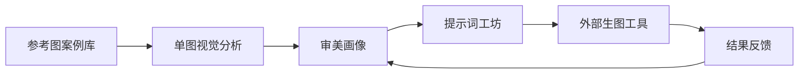

# TasteOS 项目讲解主线

这份文档用于面试讲项目。它不放进应用内，只作为你自己准备时的讲解提纲。

## 1. 30 秒版本

TasteOS 是一个面向 AI 视觉创作者的个人审美提示词工坊。它解决的问题不是“帮用户随便写一个提示词”，而是把用户长期收藏的海报、社媒封面、作品集封面转化为可复用的审美画像，再基于这个画像生成适合不同场景和不同生图工具的中文提示词包。

我把产品闭环拆成五步：参考图案例库、结构化视觉分析、审美画像、提示词工坊、结果反馈。当前 MVP 已经支持离线演示分析和真实模型分析，并能输出即梦、通义万相、豆包生图、Midjourney、DALL-E、Stable Diffusion 等格式。

## 2. 一句话定位

把“我喜欢这种视觉感觉”转化成可解释、可复用、可迭代的 AI 生图提示词系统。

## 3. 为什么做这个

AI 生图工具越来越强，但普通用户的问题不只是不会写提示词，而是不会稳定表达自己的审美偏好。

典型场景是：

- 用户收藏了很多好看的海报和视觉参考。
- 用户知道自己喜欢这些图，但很难说清楚原因。
- 用户每次生成图片都临时写提示词，结果风格不稳定。
- 用户生成失败后只会手动改词，没有沉淀为长期偏好。

所以 TasteOS 不做一个更大的生图工具，而是做“生图前的审美表达层”。

## 4. 产品闭环



每一环的作用：

- 参考图案例库：沉淀用户喜欢的海报、社媒封面和作品集封面。
- 单图视觉分析：拆解用途、风格、构图、色彩、字体、情绪和负向提示词。
- 审美画像：聚合多张参考图，形成个人长期偏好。
- 提示词工坊：按具体场景和模型格式生成正向/负向提示词。
- 结果反馈：记录生成结果的问题，让后续提示词更贴近偏好。

## 5. MVP 为什么这样收窄

我没有一开始做完整设计平台，也没有直接做生图平台，而是把 MVP 收窄到三类平面视觉场景：

- 活动海报
- 社媒封面
- 作品集 / 项目封面

原因是这三类场景都有共同结构：标题、主视觉、信息层级、情绪风格和传播目标。这样可以让分析维度稳定，也方便快速验证核心假设。

核心假设是：用户是否需要一个工具，把分散的视觉参考转化为长期可复用的提示词资产。

## 6. 当前实现

当前版本是零依赖单页 Web App，主要模块包括：

- `src/app.js`：页面状态、交互和渲染。
- `src/tasteEngine.js`：离线视觉分析、审美画像和通用提示词生成。
- `src/promptAdapters.js`：通用、Midjourney、DALL-E、Stable Diffusion、即梦、通义万相、豆包生图格式适配。
- `src/clipboard.js`：复制能力和浏览器权限降级。
- `src/apiClient.js`：前端真实模型分析请求。
- `scripts/openai-analysis.mjs`：DashScope / OpenAI 图像分析请求构造和 JSON 解析。
- `scripts/static-server.js`：本地静态服务和 `/api/analyze-reference` 代理接口。

## 7. 数据结构设计

我没有让模型直接返回一段自由文本，而是要求它输出稳定结构：

```text
VisualAnalysis / PromptDNA
- inferredPrompt
- keyPromptTerms
- negativePromptTerms
- usageCategory
- styleCategory
- compositionTerms
- colorTerms
- typographyTerms
- moodTerms
- reusablePromptPatterns
```

好处是：

- 前端展示稳定。
- 审美画像可以聚合。
- 提示词工坊可以复用。
- 离线分析和真实模型分析可以互换。
- 面试时能说明自己不是只做“套壳聊天”，而是在设计产品数据结构。

## 8. 离线分析到真实模型分析

MVP 初期我先用离线分析跑通产品闭环。原因是第一阶段要验证产品流程，而不是模型能力。

之后我新增了真实模型分析：

```text
前端新增案例
-> 选择真实模型分析
-> POST /api/analyze-reference
-> 后端读取 DASHSCOPE_API_KEY / OPENAI_API_KEY
-> 调用多模态视觉模型
-> 返回结构化中文分析
-> 前端写入案例库和审美画像
```

如果没有配置 Key 或外部模型失败，系统会回退到离线演示分析，并明确提示用户。这是为了保证演示稳定，也避免把外部服务状态变成产品流程风险。

## 9. 技术取舍

### 为什么不用复杂框架？

当前目标是快速做出可演示 MVP，所以我选择零依赖 HTML/CSS/JavaScript。这样项目可以直接本地运行，减少环境问题。

如果迁移到工程化版本，我会优先迁移到 Vite + React + TypeScript，但领域模型和数据结构可以复用。

### 为什么不直接做生图？

直接做生图会把项目重点变成模型效果和图片质量，而不是产品问题。TasteOS 的核心价值在生图前：帮助用户理解和表达自己的审美偏好。

### 为什么要做国内生图工具格式？

因为用户真实工作流里很可能使用即梦、通义万相、豆包生图。适配这些格式能说明我不是只做一个泛泛的提示词文本框，而是在考虑具体使用场景。

## 10. 可以展示的产品思维

面试时重点讲这几层：

- 问题定义：不是“AI 不会画图”，而是“用户难以稳定表达审美”。
- 场景收窄：只做海报、社媒封面、项目封面，避免第一版过散。
- 产品闭环：参考图 -> 分析 -> 画像 -> 提示词 -> 反馈。
- 数据资产：把一次性提示词变成长期审美画像和提示词历史。
- 工程边界：离线分析和真实模型分析通过同一结构互换。
- 风险诚实：主动说明哪些是离线演示，哪些是真实模型调用。

## 11. 面试开场讲法

可以这样讲：

> 我做 TasteOS 的出发点是，AI 生图工具已经足够强，但用户的审美表达能力没有同步变强。很多人收藏了大量好看的海报和视觉参考，却很难把“我喜欢这种感觉”说清楚，也很难转化成稳定提示词。
>
> 所以我没有做一个通用生图工具，而是做了生图前的审美表达层。用户先保存自己喜欢的平面视觉参考，系统把每张图拆解成用途、风格、构图、色彩、字体和情绪标签，再聚合成个人审美画像。之后用户选择具体场景和生图工具格式，系统基于这个画像生成中文提示词包，并通过结果反馈继续校准偏好。
>
> 技术上我把视觉分析抽象成稳定的数据结构。离线分析和真实模型分析都输出同样结构，所以前端的画像、提示词和反馈逻辑不用重写。真实模型模式走本地后端代理，不把 API Key 暴露在浏览器里。

## 12. 当前完成度

当前已经完成：

- PRD 和产品范围定义。
- 可演示 Web App。
- 案例库、视觉分析、审美画像、提示词工坊、反馈闭环。
- 真实模型分析接入。
- 多种生图工具提示词格式适配。
- 复制降级兜底。
- README、演示脚本和面试材料。
- 本地测试和浏览器端到端验证。

还可以继续增强：

- 图片分析缓存，降低重复调用成本。
- 更多真实设计案例数据。
- 云端账号和跨设备同步。
- 同一提示词在多个生图工具中的效果对比。
